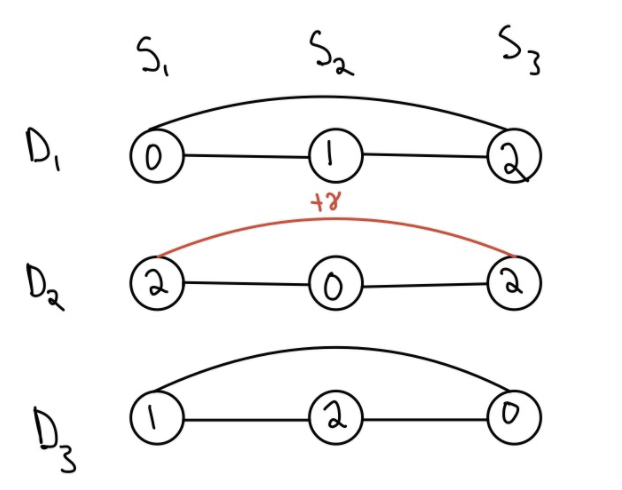
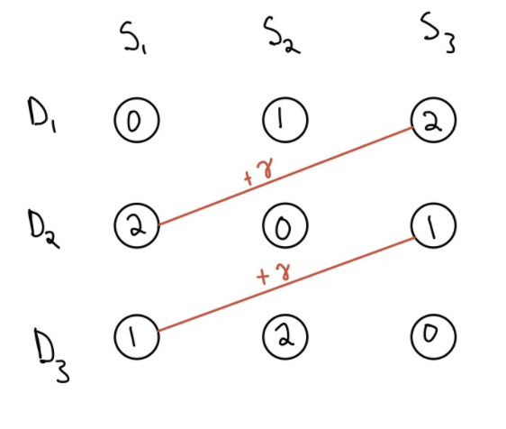
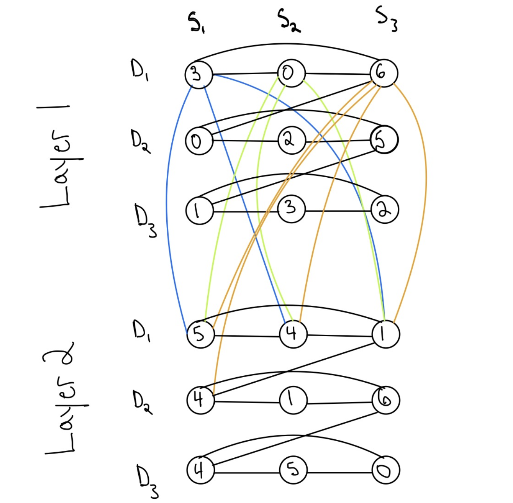

# Nurse Scheduling Problem (NSP) with DQM

This project implements a solver for the Nurse Scheduling Problem via a Discrete
Quadratic Model. We define the problem and its constraints as follows:

Given - `NURSES` = number of nurses that need to be scheduled 
      - `DAYS`   = the number of days over which the schedule is created ( assume at the end of the last day, the schedules loops )
      - `SHIFTS` = number of shifts per day that need to be covered by nurses
      - `NURSES_PER_SHIFT` = number of nurses needed to cover one shift
      - `CONFLICTS` - list of tuples representing all the groups of nurses ( integers smaller form 0 to NURSES - 1) that conflict which other ( are enemies ), and therefore should be assigned to different shifts if possible

And Constraints:

(the last two parameters already describe two of the constraints our solver supports)

1. Each shift is covered by `NURSES_PER_SHIFT` nurses ( hard constraint )
2. Nurses who are enemies with each other should have a lower probability of being in the same shift
3. Each nurse only works 1 shift/day ( hard constraint )
4. Nurses do no work shifts back to back, even if they are on different days ( hard constraint )
    (for example, it s not allowed to work the last shift of today and the first shift of tomorrow)
5. Nurses should be assigned a roughly equal workload

Find a scheduling that assigns nurses to some of the `DAYS * SHIFTS` shifts, such that all 5 reqirements 
above are met.

## How to use this solver:

Run the following command witht the appropriate command line arguments:

```python
python gc_solver.py [num_nurses] [num_days] [num_shifts] [nurses_per_shift] [conflict1] [conflict2] ... [conflictn]
```

For example, in order to compute a scheduling for 15 nurses, on 2 days, with 3 shifts/day, and requiring 3 nurses/shift,
you would have to run:

```python
python gc_solver.py 15 2 3 3
```

You can also add nurses that are enemies. Let's say that nurses 0,1,2,3, and 4 are all enemies with each other. In order
to obtain a schedule that does its best not to assign these nurses to the same shift, you would run:

```python 
python gc_solver.py 15 2 3 3 0,1,2,3,4
```

There can also be more than one group of enemies, so let's say that besides nurses 0,1,2,3,4, we also have that nurses 5,6,7,8, and 9 are also enemies with each other ( but nurses 0,5 or 1,6 etc are ok with each other ). To express this, run:

```python 
gc_solver.py 15 2 3 3 0,1,2,3,4 5,6,7,8,9
```

Note that nurses within a conflicting group need to be comma-separated.

## Approach 

This section describes our algorithm.

Because we've seen that Graph Coloring problems can be easily 
expressed in the DQM format, our approach first reduces the Nurse 
Scheduling Problem described above to a Graph Coloring problem, 
which is then translated to a DQM. The D Wave
hardware will solve this DQM, and the solution is then translated 
into a mapping from each shift to the list of nurses assigned to it.

### Reduction from NSP to Graph Coloring

We perform this reduction by building a graph which, if colorable in `NURSES`
colors, then a satifying schedule for our nurses also exists. Moreover,
any correct colouring of the graph translates to an assignment of nurses to shifts.

More formally, given an NSP problem expressed as (`NURSES`, `DAYS`, `SHIFTS`, `NURSES_PER_SHIFT`, `CONFLICTS`)
we obtain a graph G s.t:


`if (G, NURSES) is a solveable GRAPH-COLORING instance => (NURSES, DAYS, SHIFTS, NURSES_PER_SHIFT, CONFLICTS) is a solvable NSP instance`

Building G:

Nodes correspond to time slots, namely a combination of a specific shift on a given day. For example, 
for `DAYS = 2` and `SHIFTS = 3`, we would have 6 nodes in the graph.

To ensure that the nurses would only have one shift per day, we created edges between all the nodes associated 
with a given day. These edges are graphical representations of the quadratic terms of our problem, so they will
be penalized by an appropriate lagrange factor gamma:



To ensure that no nurse would be forced to endure a back to back shift, we also connected the last shift of a 
given day to the first shift of the next day.



To get a fully manned shift, we added an optional constraint to allow multiple people to staff the same shift. 
To do this, we created a duplicate of the entire graph for each working person per shift. So, if `NURSES_PER_SHIFT = 2`
then we would have 2 copies of the graph. To ensure that all nurses assigned to a shift are distinct and that the
other requirements still hold, we need to add "inter-layer" edges, or edges between the two copies of the graph.
In this sense, we projected the edges of each node ontp the second layer as well. Therefore, if all the nodes for Day 1
are connected to each other in the original graph, they will now also be connected to all the node for Day 1 in the
copy of the graph. 



    
